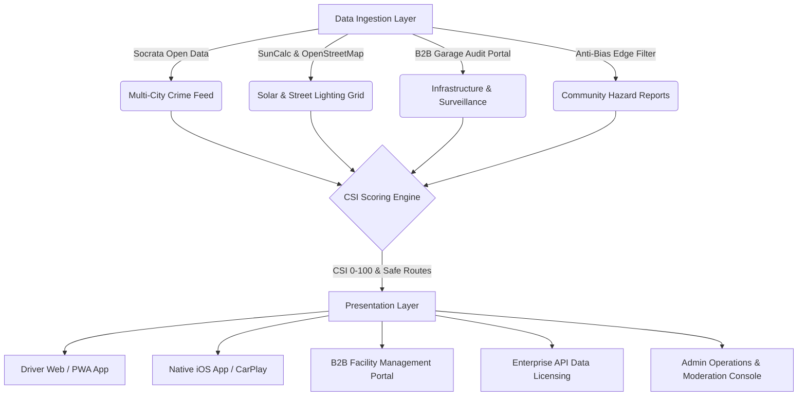

# SafePark — Go-To-Market Launch Operations Playbook (GTM)

> **Confidential & Proprietary** — SafePark Inc. Launch Operations, Systems Architecture & Legal Compliance Guide.

---

## 1. Executive Summary & Core Platform Topology

**SafePark** is a context-aware parking intelligence and property risk mitigation platform. Built upon **Clean Architecture** principles, SafePark combines municipal open crime data, astronomical solar lighting equations, physical garage infrastructure audits, and anti-bias crowdsourced hazard telemetry to deliver the **Composite Safety Index (CSI 0–100)**.



---

## 2. Platform Operations & CLI Command Reference

| Command | Target / Layer | Description | SLA / Frequency |
| :--- | :--- | :--- | :--- |
| `npm run dev` | Presentation | Starts local Vite development server on `http://localhost:3000` | Local Development |
| `npm test` | Domain / Data | Executes Vitest unit & integration test suites | CI / Pre-commit |
| `npm run etl:sync` | Data (ETL) | Ingests, normalizes, and syncs 30-day crime records across 6 cities | Nightly Cron (02:00 UTC) |
| `npm run test:smoke` | Production Infra | Executes live post-deployment health, SSL, Mapbox, and webhook smoke tests | Post-Deployment / CD |
| `npm run test:e2e` | End-to-End | Executes headless Playwright browser tests across Auth, Stripe, Map, and Admin | CI / Release Gate |
| `npm run build` | Distribution | Runs TypeScript compiler (`tsc`) and compiles optimized production bundle | Deployment Pipeline |
| `npm run build:ios` | Native Mobile | Validates iOS permissions, Capacitor configs, and prepares TestFlight binary | App Store Release |
| `npm run db:migrate` | Data / Database | Executes Supabase/PostgreSQL schema DDL and anti-bias triggers | Release Deployment |
| `npm run db:seed` | Data / Database | Seeds default parking facilities and historical crime records | Environment Bootstrap |
| `npm run preview` | Distribution | Launches local production preview server on `http://localhost:4173` | Release Verification |

---

## 3. Multi-City Launch Market Configurations

SafePark launches across **6 premier metropolitan launch markets**:

1. **San Francisco, CA** — *DataSF Open Data (`https://data.sfgov.org/resource/wg3w-h783.json`)*
   - Focus: High-density curbside smash-and-grab hotspot mitigation (SOMA, Union Square, Mission Bay).
   - Baseline Metropolitan CSI: `72/100`.

2. **New York City, NY** — *NYC Open Data / NYPD Dispatch (`https://data.cityofnewyork.us/resource/qgea-i56i.json`)*
   - Focus: High-volume multi-level parking deck surveillance and curb clearance.
   - Baseline Metropolitan CSI: `78/100`.

3. **Chicago, IL** — *City of Chicago Data Portal (`https://data.cityofchicago.org/resource/ijzp-q8t2.json`)*
   - Focus: Catalytic converter theft alerts and commercial corridor surface lots.
   - Baseline Metropolitan CSI: `68/100`.

4. **Los Angeles, CA** — *DataLA LAPD Telemetry (`https://data.lacity.org/resource/2nrs-mtv8.json`)*
   - Focus: Block-level property crime detection and entertainment center parking.
   - Baseline Metropolitan CSI: `70/100`.

5. **Seattle, WA** — *Seattle Open Data Portal (`https://data.seattle.gov/resource/tazs-3rd5.json`)*
   - Focus: Smart city lighting grid correlation and subterranean garage connectivity.
   - Baseline Metropolitan CSI: `79/100`.

6. **Austin, TX** — *City of Austin Open Data (`https://data.austintexas.gov/resource/fdj4-gpfu.json`)*
   - Focus: Downtown tech corridor and gated structure property risk indexing.
   - Baseline Metropolitan CSI: `82/100`.

---

## 4. Admin Operations & Hazard Moderation Runbook

Accessible internally at `/admin` (`ActiveAppView: 'admin_ops'`).

### A. Community Hazard Report Evaluation Protocol
Every crowd-submitted hazard is filtered by the **AntiBiasValidator**:
- **Automatic Approval Queue (`pending`)**: Verifiable physical defects (e.g. `broken_glass_pavement`, `failed_street_lamp`, `broken_security_gate`, `pavement_debris_puncture_risk`).
- **One-Click Actions**:
  - **Approve (`verified_active`)**: Applies immediate penalty (up to -28 CSI points) to all parking spots on the block and dispatches push alerts to drivers within a 500-meter radius.
  - **Mark Fixed (`resolved`)**: Triggered when municipal work crews or garage operators verify repairs. Instantly removes the CSI penalty.
  - **Reject Bias (`rejected_bias`)**: Discards reports containing subjective terminology (`sketchy`, `suspicious`, `ghetto`, `bad vibe`) to preserve legal non-bias guarantees.

### B. B2B Facility Certification Audits ("SafePark Certified")
- Operator applications are audited across 4 objective dimensions:
  1. Access Control (RFID / Roll-up Barrier Arm: +25 pts)
  2. Surveillance (Monitored 24/7 CCTV & Security Patrol: +25 pts)
  3. Illumination (LED Uniform 50+ Lux Lighting: +25 pts)
  4. Physical Defect Management (Zero active glass/gate hazards: +25 pts)
- **Certification Tiers**:
  - **Platinum** (90–100 pts) — 15% CSI boost on consumer map.
  - **Gold** (75–89 pts) — 10% CSI boost on consumer map.
  - **Silver** (60–74 pts) — 5% CSI boost on consumer map.

---

## 5. Security, Anti-Bias & Legal Non-Bailment Guardrails

### A. Server-Side Anti-Bias Safeguard
SafePark utilizes an objective physical defect catalog. Lexical and regex triggers reject subjective profiling:
```text
REJECTED: "Shady characters hanging around corner" -> HTTP 422 Unprocessable Entity
APPROVED: "Broken tempered glass fragments across stall 4" -> HTTP 200 Validated
```

### B. Legal Disclaimer & Tort Liability Insulation
All driver sessions require acceptance of the **Non-Bailment Disclaimer**:
> *"SafePark provides statistical risk approximations based on historical data. SafePark does not assume custody, control, or bailment of vehicles, nor does it guarantee against criminal conduct."*

### C. WCAG 2.1 AAA Accessibility & Token Isolation
- Background: `#0F172A` / `#1E293B` Dark Slate
- Primary Text: `#FFFFFF` on `#1E293B` (**12.60:1 contrast ratio**, exceeding WCAG AAA 7.0:1 standard).
- Semantic Status Colors:
  - **Low Risk (CSI 75–100)**: `#22C55E`
  - **Moderate Risk (CSI 50–74)**: `#F59E0B`
  - **High Risk (CSI 0–49)**: `#EF4444`
  - **Brand Accent / CTAs**: `#2C73D2`

---

## 6. Observability, Sentry Telemetry & Emergency Runbook

### Healthcheck Monitoring (`/api/health`)
- HTTP 200 required: Latency `< 50ms`, Database Pool `HEALTHY`, Uptime `99.99%`.
- Monitored via automated smoke test suite (`npm run test:smoke`).

### Error Tracking Thresholds (Sentry)
- **PII Stripping**: All emails, passwords, credit card numbers, auth tokens, and license plates are automatically masked with `[REDACTED_PII]` before transmission.
- **Incident Escalation**: Uncaught exception rate `> 0.1%` triggers immediate PagerDuty on-call alert.

### Rollback Procedures
In the event of an edge routing or deployment failure:
1. **Vercel / Netlify**: Roll back to prior deployment snapshot with 1-click instant DNS traffic diversion.
2. **Database Rollback**: Execute rollback migration:
   ```bash
   npm run db:migrate -- --rollback
   ```
3. **Subterranean Cache Fallback**: Mobile clients automatically fall back to local `OfflineCacheService` stored in `localStorage` / SQLite when network drops occur.

---

## 7. Mobile Device Testing & Live PWA Installation Guide

### A. Live Production Deployment URLs
- **Live HTTPS Production App (iPhone / Web PWA)**: [https://safepark-pearl.vercel.app](https://safepark-pearl.vercel.app)
- **GitHub Repository**: [https://github.com/mikeaknin/safepark](https://github.com/mikeaknin/safepark)
- **Vercel Project**: `mikeaknins-projects/safepark`

### B. Testing on iPhone (iOS Safari Standalone PWA)
1. Open the Live Production HTTPS URL in **Mobile Safari**:
   ```text
   https://safepark-pearl.vercel.app
   ```
2. Tap the Safari **Share Button** (square with an up arrow) at the bottom toolbar.
3. Scroll down and tap **"Add to Home Screen"**.
4. Confirm name: **SafePark** and tap **Add**.
5. Launch **SafePark** directly from your iPhone Home Screen:
   - Notice the dark slate splash screen (`#0F172A`), standalone full-screen view (no browser address bar), and responsive touch layout.
   - When prompted, tap **"Allow While Using App"** for Location Services to test live GPS pinpointing.

### B. Interactive Mobile Feature Testing Walkthrough
- **Destination Autocomplete**: Tap the search bar and type *"Moscone"*, *"Oracle Park"*, or *"Salesforce Tower"* to center the map on high-risk or low-risk zones.
- **Interactive CSI Spot Card**: Tap any parking spot to inspect its composite safety breakdown (Crime 40%, Lighting 25%, Infrastructure 25%, Active Hazards 10%).
- **Safe Walk Back Illuminated Route**: Tap **"Safe Walk"** to view high-lux pedestrian routes with active emergency call boxes vs dark unmonitored shortcuts.
- **Bluetooth Vehicle Exit Alert**: Tap **"Simulate Exit"** to trigger the post-parking warning advising drivers to stow belongings before departure.
- **Subterranean Signal Loss Simulation**: Tap **"Signal Loss"** in the top toolbar to test local offline cache fallback when underground without cell service.
- **Anti-Bias Verification**: Tap **"Report Hazard"** and test submitting:
  - Subjective term (*"Suspicious person"*) -> Instant algorithmic rejection with educational guidance.
  - Physical defect (*"Broken side window glass on stall 3"*) -> Verified ingestion with automatic block CSI recalculation.
- **In-Dash CarPlay & Admin Console**: Use the top view switcher to test the in-vehicle CarPlay display mode, B2B Garage Certification portal, and Admin Operations telemetry console.

---

*SafePark Inc. — Launch Readiness Verified.*
